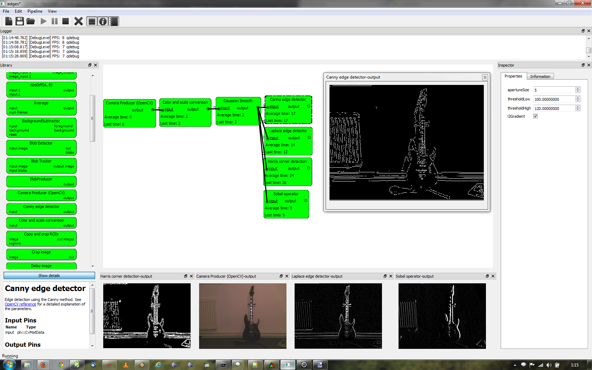
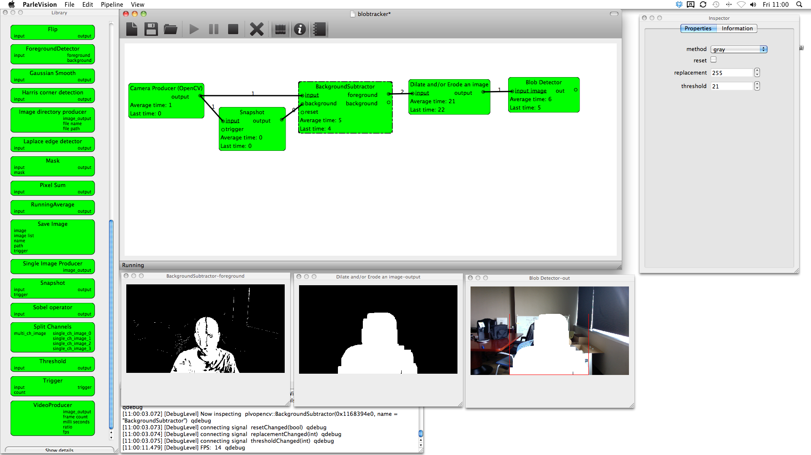

# ParleVision #

ParleVision is a graphical computer vision pipeline editor. It was based on ideas which came about while designing systems for emergent interaction in which the rapid prototyping of computer vision pipelines played an important role. The source code here is a complete rewrite of its predecessor, also called ParleVision of which examples can be seen at http://hmi.ewi.utwente.nl/showcases/parlevision which was Windows only and not open source. The primary design goals were the ease of use in relation to composing and editing of computer vision pipelines and multi-platform support.

ParleVision is written in C++ and uses the Qt library for the GUI and to abstract away the underlying operating system. It uses the OpenCV library for its computer vision algorithms. While the primary focus in on ease of use and rapid prototyping, the pipeline model can take advantage of modern processors and scales well on multiple cores.

Right now ParleVision is in alpha stage of development. Because of this we do not distribute a precompiled version yet. Below are the compilation instructions, beware these are _not_ for the faint of heart and some experience in compiling C/C++ software is recommended.

# Screenshots #

# Building ParleVision #

Depending on your platform, there are different options for building. This will first describe the general process of building ParleVision which is similar for most platforms. Below are paragraphs describing the exact process for some of the platforms.

## Source code and license ##

This project is open source and hosted on Github at http://github.com/utwente/parlevision/. It is licenced under the LGPL version 3. License can be found in the root directory or alternatively at http://www.gnu.org/licenses/lgpl.html .

## Supported Operating Systems ##

ParleVision been compiled and seen working on Windows XP, Windows Vista, Windows 7, MacOSX 10.6 and Linux (Ubuntu 9.10) as you can see in the screenshots below. However we do NOT give any guarantees that the current source will build or work correctly on any of these platforms. Main development is done on a Windows 7 machine using QtCreator, so this will in general be the best supported platform and development environment. Windows 7 using Visual Studio 10 is also tested regularly.

## Supported Compilers ##
ParleVision is completely written in C++. A standard C++ compiler which is able to build Qt should suffice. Tested compilers are Visual Studio 2010 and GCC/MingW 4.4.

ParleVision has only been compiled in 32-bit mode on x86 compatible computers. An AMD64 port should be straightforward, but has not been tested yet. Other platforms such as ARM should be possible as ParleVision depends on Qt and OpenCV both of which support ARM.

## Dependencies ##

ParleVision depends on:

* Qt      >= 4.6
* OpenCV  == 2.3.1 (no other versions supported, read known issues below!)
* libQxt  >= 0.6   (parlevision-core depends on the QxtCore library for advanced logging features)

### Qt and Qt SDK ###

Parlevision has been built and tested using the QtSDK v1.0 and v1.1 using QtCreator and Mingw. It has been built using all Qt versions > 4.6. Parlevision-core depends on QtCore and QtXML while Parlevision-gui depends on the QtGUI.

### OpenCV ###

ParleVision only supports the latest version of OpenCV (OpenCV 2.3.1). 

### libQxt ###

Parlevision-core depends on the Qxt library for advanced logging features.
Follow the build instruction in the documentation. (configure, make, make install)
Libqxt will add itself to the Qt features directory. In order for correct makefile generation by QMake you need to run Qmake on Parlevision-all.pro after installation of libqxt.
                
## Install dependencies ##

1. Download and install the QtSDK from http://qt.nokia.com/downloads. We recommend Qt SDK version 1.1.0, but 1.1.4 should also work but is not tested as thoroughly.
2. Install OpenCV 2.3.1. This depends on your OS:
    * Mac OS X - the easiest way is to install through MacPorts
    * Windows - Download binaries from http://opencv.willowgarage.com/ it includes MingW and Visual Studio binaries.
3. Download, compile and install Qxt from http://dev.libqxt.org/libqxt

## Fixing Build Environment ##
If your libraries are in different locations than the default (they will most certainly be), you will have to tell the build system where to find them. You have to edit common.pri in the root of your ParleVision directory to fill out the correct library locations.

## Choose development evironment ##

A. Using Qt Creator (all platforms)
Open ParleVision-all.pro in the QtCreator IDE. Choose whether you want to build in Debug or Release mode using the "Build/Run Target Selector" and then select "Build Project 'ParleVision'".

B. Using Make (unix)
...

C. Using XCode
...

D. Using Visual Studio 2010 (required for MS Kinect SDK plugin to work). See below for a complete description on how to build ParleVision5 in Visual Studio 2010.

## Building ParleVision5 with Visual Studio 2010 ##

This paragraph will describe how to compile ParleVision5 with Visual Studio 2010.

Normally we would download already compiled binaries for MSVC2010 from the Qt Nokia website. However binaries for MSVC2010 are not available (yet), so we first need to compile Qt 4.7.x with VS2010. 

Here we will describe a step-by-step guide on how to compile Qt 4.7.x (For this example I used 4.7.3) for MSVC2010 manually. This guide was adapted from http://www.holoborodko.com/pavel/2011/02/01/how-to-compile-qt-4-7-with-visual-studio-2010/

Install MSVC2010. Express will not work since it does not support add-ins which you need for Qt integration, so you need the Professional or Ultimate edition.

Install appropriate software from Qt for Windows Requirements list. These are Perl and the DirectX SDK. You also need the Windows SDK, but this already comes with VS2010.

Download and install the Qt Visual Studio Add-in from the Qt website.

Download and extract Qt 4.7.3 Source Code and move or copy the contents of the folder qt-everywhere-opensource-src-4.7.3 to the directory where you intend to install Qt. In my case this is "C:\Qt\4.7.3" .
    
Set up the environmental variables. You can add these to the environment variables using the Windows GUI or use the "set" command in the command prompt. You would need to call "set" everytime you open a command prompt window, so adding them to the permanent system variables is preferrable.
    QTDIR=C:\Qt\4.7.3
    QMAKESPEC=win32-msvc2010
	.. and update the PATH variable to include %QTDIR%\bin
    
To compile Qt using multiple cores download the latest version of jom from ftp://ftp.qt.nokia.com/jom/. Extract the jom files to C:\Qt\jom folder

Start Visual Studio 2010 Command Prompt: Start > Programs > Microsoft Visual Studio 2010 > Visual Studio Tools > Visual Studio Command Prompt.

Run the following commands in it:
	cd c:\Qt\4.7.3
    configure -debug-and-release -opensource -platform win32-msvc2010
    ..\jom\jom.exe -j 4 (where 4 is the number of threads, use more if you have more hardware cores/threads available)

Install OpenCV. Compilee it yourself using CMAKE and VS2010. See the instructions on the OpenCV website.

If you want to use QtCreator: to enable debugging in QtCreator when compiling with VC++ compiler see
http://doc.qt.nokia.com/qtcreator-snapshot/creator-debugger-engines.html

## Known issues ##

First of all see the issue tracker on our github page https://github.com/utwente/parlevision/issues

There seems to be something wrong with the prebuilt binaries in the OpenCV 2.3.1/build/x86/mingw/release directory which generate an error. The error is "Procedure entry point _ZNSt9exceptionD2Ev could not be located in dynamic link library libstdc++6.dll". It is solved by building the binaries from the OpenCV source using CMake and Mingw.

Linux and MacOSX ports are not maintained at all at the moment. Building them will probably take some work. 

OpenCV camera support sometimes fails on MacOSX. See http://stackoverflow.com/questions/3363637/opencv-2-1-mac-os-x-webcam-issues-32-and-64-bit. Also, there are numurous problems with the MacPorts versions of OpenCV 2.0 and 2.1. However, ParleVision does built with OpenCV2.2.0 on MaxOSX 10.6 using Brew. [to be continued]

# Icon Set #
Icons: Symbolize Icon Set, version 1.0
http://dryicons.com/free-icons/preview/symbolize-icons-set/
